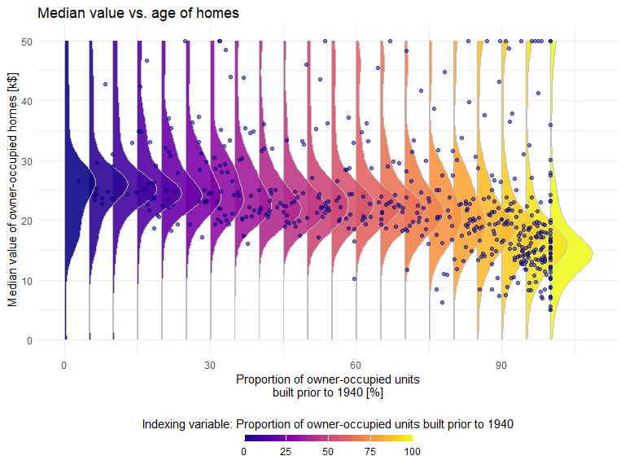

Introduction to SLGP Package
================
Athénaïs Gautier

This vignette serves as a startup guide to SLGP modeling, providing a
practical introduction to the implementation of Spatial Logistic
Gaussian Processes (SLGPs).

# Dataset

We illustrate the model’s capabilities using the Boston Housing dataset
Harrison and Rubinfeld (1978), a widely used benchmark in statistical
modeling and regression analysis.

For this vignette, we focus on modeling the distribution of median home
values (med) as a function of the proportion of pre-1940 owner-occupied
units (age). This example highlights the ability of SLGPs to capture
complex, spatially dependent distributions in data that exhibit
heterogeneity and multi-modality.

``` r
library(dplyr)
# Load the dataset (available in MASS package)
if (!requireNamespace("MASS", quietly = TRUE)) install.packages("MASS")
data("Boston", package = "MASS")
df <- Boston %>%
  mutate(age_bin = cut(age, breaks = seq(0, 100, by = 10), include.lowest = FALSE)) %>%
  group_by(age_bin) %>%
  mutate(age_bin = paste0(age_bin, "\nn=", n()))%>%
  ungroup()%>%
  mutate(age_bin = factor(age_bin, levels = sort(unique(age_bin), decreasing = FALSE)))

range_response <- c(0, 50) # Can use range(df$medv), or user defined range as we do here
range_x <- c(0, 100) # Can use range(df$age), or user defined range as we do here
```

We represent the data.

``` r
library(ggplot2)
library(ggpubr)

# Scatterplot: med vs. age
scatter_plot <- ggplot(df, aes(x = age, y = medv)) +
  geom_point(alpha = 0.5, color = "navy") +
  labs(x = "Proportion of owner-occupied units\nbuilt prior to 1940 [%]", 
       y = "Median value of owner-occupied homes [k$]",
       title = "Median value vs. age of homes") +
  theme_minimal()+
  coord_cartesian(xlim=range_x,
                  ylim=range_response)

# Histogram: Distribution of med by age bin
hist_plot <- ggplot(df, aes(x = medv)) +
  geom_histogram(mapping=aes(y=after_stat(density)),
                 position = "identity", breaks = seq(0, 50, 2.5),
                 fill="darkgrey", col="grey50", lwd=0.2, alpha=0.7) +
  geom_rug(sides = "b", color = "navy", alpha = 0.5)+
  facet_wrap(~ age_bin, scales = "free_y", nrow=2) +
  labs(x = "Median value of owner-occupied homes [k$]", 
       y = "Probability density", 
       title = "Histogram of median value by age group") +
  theme_minimal()+
  coord_cartesian(xlim=range_response,
                  ylim=c(0, 0.25))
ggarrange(scatter_plot, hist_plot, ncol = 2, nrow = 1, labels = c("A", "B"),
          widths = c(0.3, 0.7))
```

<div class="figure" style="text-align: center">


<p class="caption">
Figure 1: A visual representation of the dependency of the median value
of owner-occupied homes on proportion of owner-occupied units
constructed before 1940 in the Boston Housing dataset.
</p>

</div>

We see that there is a general trend where older homes tend to have
lower values, with exceptions likely due to survivor bias: older homes
that remain tend to be of higher structural quality. This dataset
provides an test case for SLGP modeling, offering a compact,
one-dimensional covariate space, heterogeneously distributed data, and
shifting distributional shapes.

# SLGP model specifications

To model the distributional changes observed in the Boston Housing
dataset, we now introduce the Spatial Logistic Gaussian Process (SLGP)
model. SLGPs provide a flexible non-parametric framework for modeling
spatially dependent probability densities. By transforming a Gaussian
Process (GP) through exponentiation and normalization, SLGPs ensure
positivity and integration to one, making them well-suited for density
estimation.

## Maximum a posteriori estimate

For a quicker approximation, MAP estimation provides a point estimate,
offering a balance between computational efficiency and the depth of
inference. It is the fastest estimation scheme we propose, however MAP
does not facilitate uncertainty quantification because it yields a
non-probabilistic estimate of the underlying density field, focusing
instead on identifying the mode of the posterior distribution.

``` r
library(SLGP)

modelMAP <- slgp(medv~age, # Use a formula to specify predictors VS response
                 # Can use medv~. for all variables,
                 # Or medv ~ age + var2 + var3 for more variables
                 data=df,
                 method="MAP", #Maximum a posteriori estimation scheme
                 basisFunctionsUsed = "RFF",
                 interpolateBasisFun="WNN", # Accelerate inference
                 hyperparams = list(lengthscale=c(0.15, 0.15), 
                                    # Applied to normalised data
                                    # So 0.15 is 15% of the range of values
                                    sigma2=1), 
                 # Will be re-selected with sigmaEstimationMethod
                 sigmaEstimationMethod = "heuristic", # Set to heuristic for numerical stability                 
                 predictorsLower= c(range_x[1]),
                 predictorsUpper= c(range_x[2]),
                 responseRange= range_response,
                 opts_BasisFun = list(nFreq=100,
                                      MatParam=5/2))
```

We can represent the conditional density as a colormap.

``` r
library(SLGP)
library(viridis)
dfGrid <- data.frame(expand.grid(seq(range_x[1], range_x[2],, 101), 
                                 seq(range_response[1], range_response[2],, 101)))
colnames(dfGrid) <- c("age", "medv")
pred <- predictSLGP_newNode(SLGPmodel=modelMAP,
                            newNodes = dfGrid)

ggplot()  +
  labs(y = "Proportion of owner-occupied units\nbuilt prior to 1940 [%]", 
       x = "Median value of owner-occupied homes [k$]",
       title = "Median value vs. age of homes") +
  theme_minimal()+
  geom_raster(data=pred,
              mapping=aes(x=age, y=medv, fill=pdf_1))+
  geom_point(data=df,
             mapping=aes(x=age, y=medv), alpha = 0.5, 
             pch="x", col="grey")+
  scale_fill_viridis(option = "viridis",
                     guide = guide_colorbar(nrow = 1,
                                            title = "Probability density of med at age",
                                            barheight = unit(2, units = "mm"),
                                            barwidth = unit(55, units = "mm"),
                                            title.position = 'top',
                                            label.position = "bottom",
                                            title.hjust = 0.5))+
  theme(legend.position = "bottom")
```

<div class="figure" style="text-align: center">


<p class="caption">
Figure 2: Predictive probability density of medv at age, as predicted by
a SLGP.
</p>

</div>

``` r
library(SLGP)
library(viridis)
dfGrid <- data.frame(expand.grid(seq(range_x[1], range_x[2], 5), 
                                 seq(range_response[1], range_response[2],, 101)))
colnames(dfGrid) <- c("age", "medv")
pred <- predictSLGP_newNode(SLGPmodel=modelMAP,
                            newNodes = dfGrid)

scale_factor <- 100
ggplot()  +
  labs(y = "Proportion of owner-occupied units\nbuilt prior to 1940 [%]", 
       x = "Median value of owner-occupied homes [k$]",
       title = "Median value vs. age of homes") +
  theme_minimal()+
  geom_ribbon(data=pred,
              mapping=aes(x=medv, ymax=scale_factor*pdf_1+age, 
                          ymin=age, group=-age, fill=age),
              col="grey", alpha=0.9)+
  geom_point(data=df,
             mapping=aes(x = medv, y = age), alpha = 0.5, color = "navy")+
  scale_fill_viridis(option = "plasma",
                     guide = guide_colorbar(nrow = 1,
                                            title = "Indexing variable: Proportion of owner-occupied units built prior to 1940",
                                            barheight = unit(2, units = "mm"),
                                            barwidth = unit(55, units = "mm"),
                                            title.position = 'top',
                                            label.position = "bottom",
                                            title.hjust = 0.5))+
  theme(legend.position = "bottom")+
  coord_flip()
```

<div class="figure" style="text-align: center">


<p class="caption">
Figure 3: Predictive probability density of medv at age, seen over
slices.
</p>

</div>

## Laplace approximation estimate

By integrating the MAP approach with Laplace approximation, we refine
our estimation strategy by approximating the posterior distribution with
a multivariate Gaussian. This method strikes a balance between the full
Bayesian inference of MCMC and the computational efficiency of MAP
estimation. By leveraging both the gradient and Hessian of the
posterior, it captures essential curvature information, providing a more
informed approximation of the posterior landscape.

``` r
modelLaplace <- slgp(medv~age, # Use a formula to specify predictors VS response
                     # Can use medv~. for all variables,
                     # Or medv ~ age + var2 + var3 for more variables
                     data=df,
                     method="Laplace", #Maximum a posteriori + Laplace approximation
                     basisFunctionsUsed = "RFF",
                     interpolateBasisFun="WNN", # Accelerate inference
                     hyperparams = list(lengthscale=c(0.15, 0.15), 
                                        # Applied to normalised data
                                        # So 0.15 is 15% of the range of values
                                        sigma2=1), 
                     # Will be re-selected with sigmaEstimationMethod
                     sigmaEstimationMethod = "heuristic", # Set to heuristic for numerical stability                 
                     predictorsLower= c(range_x[1]),
                     predictorsUpper= c(range_x[2]),
                     responseRange= range_response,
                     opts_BasisFun = list(nFreq=100,
                                          MatParam=5/2))
```

``` r
# Define the three selected values
selected_values <- c(20, 50, 95)
gap <- 2.5

dfGrid <- data.frame(expand.grid(seq(3), 
                                 seq(range_response[1], range_response[2],, 101)))
colnames(dfGrid) <- c("ID", "medv")
dfGrid$age <- selected_values[dfGrid$ID]
pred <- predictSLGP_newNode(SLGPmodel=modelLaplace,
                            newNodes = dfGrid)
pred$meanpdf <- rowMeans(pred[, -c(1:3)])

library(tidyr)
# Filter the data: keep values within ±5 of the selected ones
df_filtered <- df %>%
  mutate(interval=findInterval(age, c(0, 
                                      selected_values[1]-gap, 
                                      selected_values[1]+gap, 
                                      selected_values[2]-gap, 
                                      selected_values[2]+gap, 
                                      selected_values[3]-gap, 
                                      selected_values[3]+gap)))%>%
  filter(interval %in% c(2, 4, 6))%>%
  group_by(interval)%>%
  mutate(category = paste0("Age close to ", c("", selected_values[1],
                                              "", selected_values[2],
                                              "", selected_values[3])[interval], 
                           "\nn=", n()))
names <- sort(unique(df_filtered$category))
pred$category <- names[pred$ID]

set.seed(1)
selected_cols <- sample(seq(1000), size=10, replace=FALSE)
df_plot <- pred %>%
  dplyr::select(c("age", "medv", "category", 
                  paste0("pdf_", selected_cols)))%>%
  pivot_longer(-c("age", "medv", "category"))


ggplot(mapping=aes(x = medv)) +
  geom_histogram(df_filtered,
                 mapping=aes(y=after_stat(density)),
                 position = "identity", breaks = seq(0, 50, 2.5),
                 fill="darkgrey", col="grey50", lwd=0.2, alpha=0.7) +
  geom_rug(data=df_filtered, sides = "b", color = "navy", alpha = 0.5)+
  geom_line(data=df_plot, mapping=aes(y=value, group=name), 
            color = "black", lwd=0.1, alpha=0.5)+
  geom_line(data=pred, mapping=aes(y=meanpdf, group=category), color = "red")+
  facet_wrap(~ category, scales = "free_y", nrow=1) +
  labs(x = "Median value of owner-occupied homes [k$]", 
       y = "Probability density", 
       title = "Histogram of median value at bins centered at several 'age' values, with width 5\nversus SLGP draws from a laplace approximation (black curves) and average (red curve)") +
  theme_minimal()+
  coord_cartesian(xlim=range_response,
                  ylim=c(0, 0.25))
```

<div class="figure" style="text-align: center">


<p class="caption">
Figure 4: Predictive probability density (and draws from a Laplace
approximation) of medv at age, seen over 3 slices.
</p>

</div>

## MCMC estimate

This method allows us to explore the posterior distribution by drawing
samples from it. It enables precise, exact inference of the posterior
distribution of the underlying density field knowing the data. The main
drawback of this approach being its higher computational cost

``` r
modelMCMC <- slgp(medv~age, # Use a formula to specify predictors VS response
                  # Can use medv~. for all variables,
                  # Or medv ~ age + var2 + var3 for more variables
                  data=df,
                  method="MCMC", #MCMC
                  basisFunctionsUsed = "RFF",
                  interpolateBasisFun="WNN", # Accelerate inference
                  hyperparams = list(lengthscale=c(0.15, 0.15), 
                                     # Applied to normalised data
                                     # So 0.15 is 15% of the range of values
                                     sigma2=1), 
                  # Will be re-selected with sigmaEstimationMethod
                  sigmaEstimationMethod = "heuristic", # Set to heuristic for numerical stability                 
                  predictorsLower= c(range_x[1]),
                  predictorsUpper= c(range_x[2]),
                  responseRange= range_response,
                  opts_BasisFun = list(nFreq=100,
                                       MatParam=5/2),
                  opts = list(stan_chains=2, stan_iter=1000))
#> 
#> SAMPLING FOR MODEL 'SLGP_Likelihood_composed' NOW (CHAIN 1).
#> Chain 1: 
#> Chain 1: Gradient evaluation took 0.002219 seconds
#> Chain 1: 1000 transitions using 10 leapfrog steps per transition would take 22.19 seconds.
#> Chain 1: Adjust your expectations accordingly!
#> Chain 1: 
#> Chain 1: 
#> Chain 1: Iteration:   1 / 1000 [  0%]  (Warmup)
#> Chain 1: Iteration: 100 / 1000 [ 10%]  (Warmup)
#> Chain 1: Iteration: 200 / 1000 [ 20%]  (Warmup)
#> Chain 1: Iteration: 300 / 1000 [ 30%]  (Warmup)
#> Chain 1: Iteration: 400 / 1000 [ 40%]  (Warmup)
#> Chain 1: Iteration: 500 / 1000 [ 50%]  (Warmup)
#> Chain 1: Iteration: 501 / 1000 [ 50%]  (Sampling)
#> Chain 1: Iteration: 600 / 1000 [ 60%]  (Sampling)
#> Chain 1: Iteration: 700 / 1000 [ 70%]  (Sampling)
#> Chain 1: Iteration: 800 / 1000 [ 80%]  (Sampling)
#> Chain 1: Iteration: 900 / 1000 [ 90%]  (Sampling)
#> Chain 1: Iteration: 1000 / 1000 [100%]  (Sampling)
#> Chain 1: 
#> Chain 1:  Elapsed Time: 19.28 seconds (Warm-up)
#> Chain 1:                18.733 seconds (Sampling)
#> Chain 1:                38.013 seconds (Total)
#> Chain 1: 
#> 
#> SAMPLING FOR MODEL 'SLGP_Likelihood_composed' NOW (CHAIN 2).
#> Chain 2: 
#> Chain 2: Gradient evaluation took 0.001717 seconds
#> Chain 2: 1000 transitions using 10 leapfrog steps per transition would take 17.17 seconds.
#> Chain 2: Adjust your expectations accordingly!
#> Chain 2: 
#> Chain 2: 
#> Chain 2: Iteration:   1 / 1000 [  0%]  (Warmup)
#> Chain 2: Iteration: 100 / 1000 [ 10%]  (Warmup)
#> Chain 2: Iteration: 200 / 1000 [ 20%]  (Warmup)
#> Chain 2: Iteration: 300 / 1000 [ 30%]  (Warmup)
#> Chain 2: Iteration: 400 / 1000 [ 40%]  (Warmup)
#> Chain 2: Iteration: 500 / 1000 [ 50%]  (Warmup)
#> Chain 2: Iteration: 501 / 1000 [ 50%]  (Sampling)
#> Chain 2: Iteration: 600 / 1000 [ 60%]  (Sampling)
#> Chain 2: Iteration: 700 / 1000 [ 70%]  (Sampling)
#> Chain 2: Iteration: 800 / 1000 [ 80%]  (Sampling)
#> Chain 2: Iteration: 900 / 1000 [ 90%]  (Sampling)
#> Chain 2: Iteration: 1000 / 1000 [100%]  (Sampling)
#> Chain 2: 
#> Chain 2:  Elapsed Time: 22.148 seconds (Warm-up)
#> Chain 2:                21.176 seconds (Sampling)
#> Chain 2:                43.324 seconds (Total)
#> Chain 2: 
#> Convergence diagnostics:
#>   * A R-hat close to 1 indicates a good convergence.
#> Here, the dimension of the sampled values is 200.
#> The range of the R-hats is: 0.99802 - 1.00126  * Effective Sample Sizes estimates the number of independent draws from the posterior.
#> Higher values are better.
#> The range of the ESS is: 1279.1 - 3000  * Checking the Bayesian Fraction of Missing Information is also a way to locate issues.
#> E-BFMI indicated no pathological behavior.
```

``` r
# Define the three selected values
pred <- predictSLGP_newNode(SLGPmodel=modelMCMC,
                            newNodes = dfGrid)
pred$meanpdf <- rowMeans(pred[, -c(1:3)])
pred$category <- names[pred$ID]

df_plot <- pred %>%
  dplyr::select(c("age", "medv", "category", 
                  paste0("pdf_", selected_cols)))%>%
  pivot_longer(-c("age", "medv", "category"))


ggplot(mapping=aes(x = medv)) +
  geom_histogram(df_filtered,
                 mapping=aes(y=after_stat(density)),
                 position = "identity", breaks = seq(0, 50, 2.5),
                 fill="darkgrey", col="grey50", lwd=0.2, alpha=0.7) +
  geom_rug(data=df_filtered, sides = "b", color = "navy", alpha = 0.5)+
  geom_line(data=df_plot, mapping=aes(y=value, group=name), 
            color = "black", lwd=0.1, alpha=0.5)+
  geom_line(data=pred, mapping=aes(y=meanpdf, group=category), color = "red")+
  facet_wrap(~ category, scales = "free_y", nrow=1) +
  labs(x = "Median value of owner-occupied homes [k$]", 
       y = "Probability density", 
       title = "Histogram of median value at bins centered at several 'age' values, with width 5\nversus SLGP draws from a MCMC (black curves) and average (red curve)") +
  theme_minimal()+
  coord_cartesian(xlim=range_response,
                  ylim=c(0, 0.25))
```

<div class="figure" style="text-align: center">


<p class="caption">
Figure 5: Predictive probability density (and draws from a MCMC) of medv
at age, seen over 3 slices.
</p>

</div>

<div id="refs" class="references csl-bib-body hanging-indent"
entry-spacing="0">

<div id="ref-harrison_hedonic_1978" class="csl-entry">

Harrison, David, and Daniel L Rubinfeld. 1978. “Hedonic Housing Prices
and the Demand for Clean Air.” *Journal of Environmental Economics and
Management* 5 (1): 81–102.
<https://doi.org/10.1016/0095-0696(78)90006-2>.

</div>

</div>
